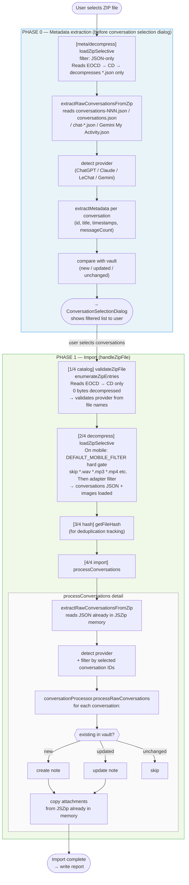

# Import Workflow

This document describes the full import pipeline, from ZIP file selection to vault note creation.

## Glossary

- **EOCD** — End Of Central Directory: a ~22-byte record at the very end of a ZIP file, pointing to where the Central Directory starts.
- **CD** — Central Directory: an index at the end of the ZIP file listing all entries (names, sizes, compressed offsets) **without any file content**. Reading EOCD + CD = zero decompression.
- **loadZipSelective** — reads EOCD → CD → decompresses only entries matching a filter, via `File.slice`. Skipped entries are never touched.
- **enumerateZipEntries** — reads EOCD → CD only, returns `Array<{path, size}>`. Zero decompression. Used for validation.
- **DEFAULT_MOBILE_FILTER** — on mobile, blocks all audio/video extensions (`.wav`, `.mp3`, `.mp4`, etc.) regardless of adapter rules, to prevent OOM.

---

## Full Workflow Diagram



---

## Expected Log Output

With the `[NexusAI][HH:MM:SS.mmm]` timestamps and phase labels, a healthy mobile import should look like:

```
[meta/decompress] Loading xyz.zip (468489698 bytes, mobile=true)
  loadZipSelectiveMobile: findEOCD start (468489698 bytes)
  loadZipSelectiveMobile: EOCD found — cdOffset=... entries=620
  loadZipSelectiveMobile: CD parsed — 620 non-dir entries
  decompressEntry: "conversations-000.json" compressed=... uncompressed=...
  decompressEntry: "conversations-000.json" done
  ... (other JSON files)
  loadZipSelectiveMobile: done — included=9 skipped=611
[meta/decompress] ZIP loaded — 9 JSON entries

[1/4 catalog] Reading ZIP Central Directory: xyz.zip (468489698 bytes, mobile=true)
  loadZipSelectiveMobile: findEOCD start
  loadZipSelectiveMobile: EOCD found — 620 entries
  loadZipSelectiveMobile: CD parsed — 620 non-dir entries
[1/4 catalog] Done — 620 entries listed, 0 bytes decompressed, provider=chatgpt

[2/4 decompress] Loading ZIP entries (mobile=true, filter=custom)
  loadZipSelectiveMobile: findEOCD start
  loadZipSelectiveMobile: EOCD found — 620 entries
  loadZipSelectiveMobile: CD parsed — 620 non-dir entries
  decompressEntry: "conversations-000.json" ...  ✅ JSON included
  decompressEntry: "file-xxx.png" ...            ✅ image included
  (no WAV/MP3/MP4 entries)                       ✅ blocked by DEFAULT_MOBILE_FILTER
  loadZipSelectiveMobile: done — included=N skipped=M
[2/4 decompress] Done — N entries in memory

[3/4 hash] Computing file hash (shared mode, mobile=true)
[3/4 hash] Done

[4/4 import] processConversations start
[4/4 import] processConversations done
```

---

## Known Architectural Limitation

`loadZipSelective` (step 2/4) loads **all matching entries upfront** into a JSZip object.
This means all images for all conversations are in memory before we know which conversations
the user selected. A future improvement would load attachments lazily, per conversation,
using `File.slice` only when needed during processing.

For the 1.5.x mobile hardening work, the mitigation is the `DEFAULT_MOBILE_FILTER` hard gate which skips audio/video
(the largest contributors to OOM) while preserving image attachments.

---

## Provider Detection (Structural, from file names)

Detection order in `validateZipFile` (phase 1, catalog step):

| Provider | Required files | Exclusive signature |
|---|---|---|
| **Le Chat** | `chat-<uuid>.json` pattern | `chat-` prefix |
| **Gemini** | `Takeout/<Activity>/<*Gemini*>/My Activity.json` | Takeout folder structure |
| **ChatGPT** | `conversations.json` or `conversations-NNN.json` | `user.json` (singular, no `users.json`) |
| **Claude** | `conversations.json` + `users.json` | `users.json` (plural) |

Cross-provider mismatch (e.g. selecting ChatGPT but ZIP contains `users.json`) raises an
error dialog before any decompression occurs.
